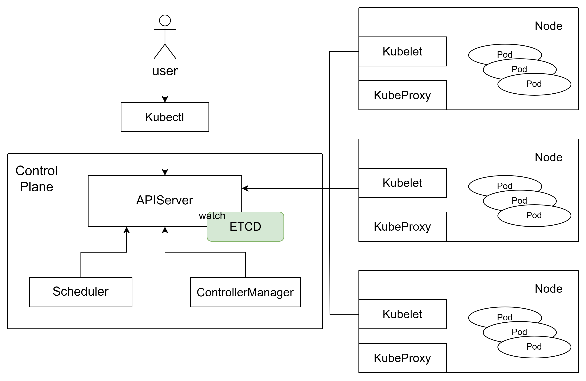
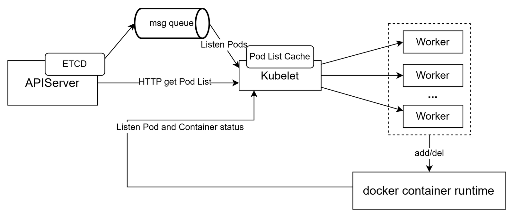
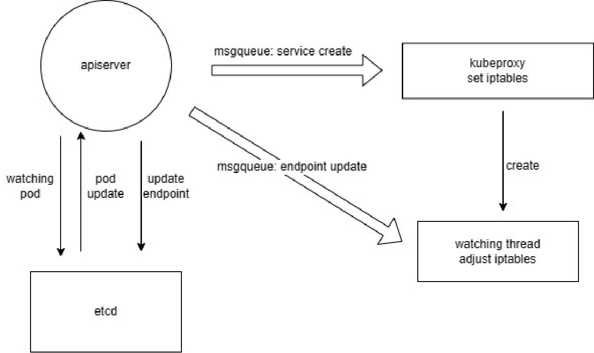
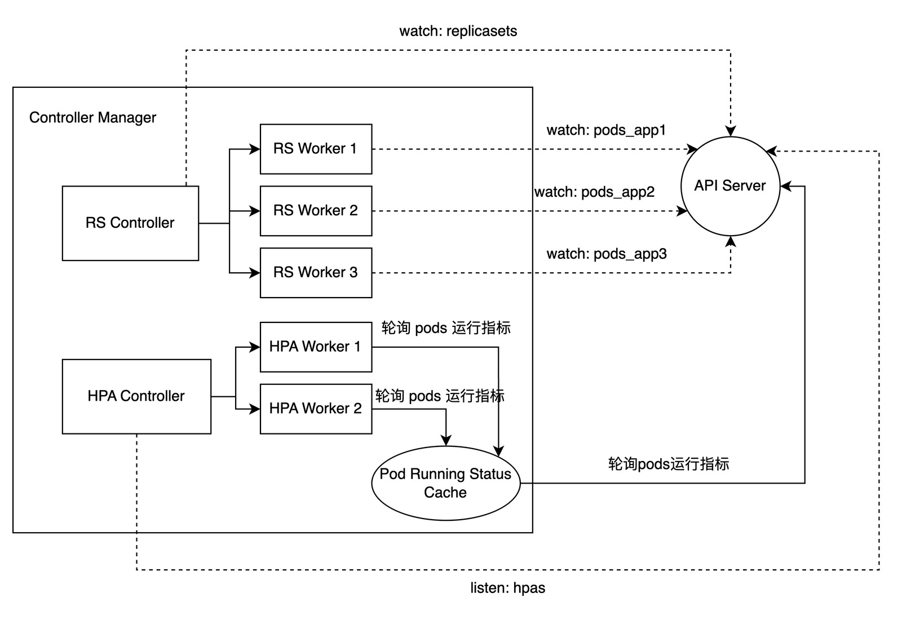
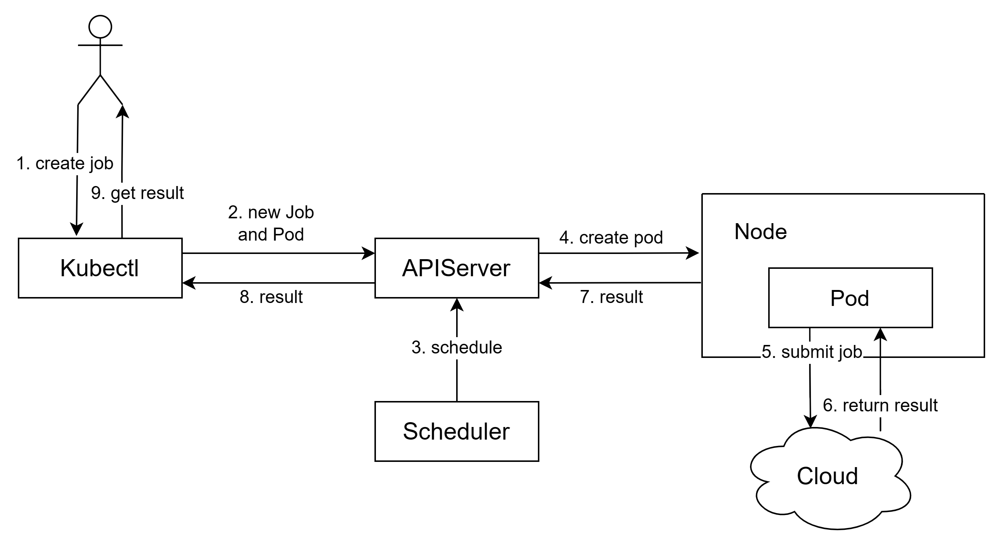
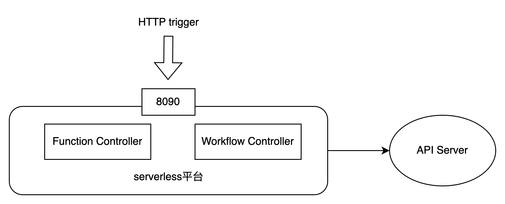

# minik8s - CloudOS

## Contents

- [Tiger Compiler Labs in C++](#tiger-compiler-labs-in-c)
  - [Contents](#contents)
  - [Overview](#overview)
  - [Lab 1: Straight-line Program Interpreter](#lab-1-straight-line-program-interpreter)
  - [Lab 2: Lexical Analysis](#lab-2-lexical-analysis)
  - [Lab 3: Parsing](#lab-3-parsing)
  - [Lab 4: Type Checking](#lab-4-type-checking)
  - [Lab 5: Tiger Compiler without register allocation](#lab-5-tiger-compiler-without-register-allocation)
  - [Lab 6: Register Allocation](#lab-6-register-allocation)
  - [Commands](#commands)

## Overview

Course project of SJTU SE3356, 2023.

This project is a three-person team effort. We together developed a mini container orchestration tool called minik8s, which supports basic functions such as container lifecycle management and auto-scaling. It also integrates with serverless platforms.

## Team Members and Contributions

  |Name         |Responsibilities                 |Contribution|
  |------------|--------------------------------------|-----|
  |Xie Chen         |CNI、service、DNS                     | 1/3|
  |Yang Jialu       |Replicaset、HPA、Serverless           | 1/3|
  |Liu Rongchuan       |Kubelet、APIServer、Scheduler、GPU     |1/3|


## Overall Project Architecture



The overall project architecture closely resembles the implementation of Kubernetes, but with some simplifications.

The APIServer is responsible for facilitating interactions between various components. The persistent state of system objects is stored in ETCD, providing fault tolerance for control plane failures.

Users interact with the system using the command-line tool Kubectl, which allows them to create, delete, update objects, and view object statuses, among other operations. Other components communicate with the APIServer through both HTTP protocol and message queue subscriptions.

**Programming Languages**: Go, Shell, Python

**Software Stack**: ETCD, Docker, RabbitMQ, go-restful, CoreDNS, nginx, flannel, go-daily-lib/cli, go-yaml

## Kubectl Commands

```shell
# node
kubectl create node -f <node yaml path>
kubectl get nodes

# pod
kubectl create pod -f <pod yaml path>
kubectl get pods                 #get simple info of all pods
kubectl get pod <pod name>       #get simple info of a pod
kubectl describe pod <pod name>  #get details of a pod
kubectl delete pod <pod name>

# service 
kubectl create service -f <service yaml path>
kubectl delete service <serviec name>
kubectl get services    # get service list
kubectl describe service <serivce name>    # get detail info of a service

# dns
kubectl create dns -f <dns yaml path>

# replicaset
kubectl create RS -f <rs yaml path>
kubectl update RS -f <rs yaml path>
kubectl delete RS <rs name>
kubectl describe replicaset <rs name> #get details of a rs
kubectl get replicasets               #get simple info of all rs

# hpa
kubectl create HPA -f <hpa yaml path>
kubectl update HPA -f <hpa yaml path>
kubectl delete HPA <hpa name>
kubectl describe hpa <hpa name>  #get details of a hpa
kubectl get hpas                 #get simple info of all hpas

# GPUJob
kubectl create GPUJob -f <GPUJob yaml path> -cu <cuda program path>
kubectl get GPUJob <job name>

# serverless
kubectl create function -f <*.py path> <function name>
kubectl update function -f <*.py path> <function name>
kubectl delete function <function name>
kubectl get functions

kubectl create workflow -f <workflow yaml path>
kubectl get workflows

kubectl invoke function <function name> <params>
kubectl invoke workflow <workflow name>
# In addition to the command line, functions and workflows can also be invoked using an HTTP trigger.
```

## Components Implementation

> In this section, we have **bolded** the resolved corner cases, additional implemented features, or the parts we consider to be more challenging.

### APIServer

-   Performing CRUD operations on data in ETCD: Implementing the interface of the ETCD library.

-   Handling HTTP requests:

    Using the [go-restful library](https://github.com/emicklei/go-restful), define WebServices and Routes objects according to requirements, along with corresponding handling functions, to process specific requests.

-   Listening for ETCD Data Changes and Publishing:

    After detecting data changes using the watch interface in the ETCD library, publish the data to different [RabbitMQ](https://www.rabbitmq.com/) message queues based on the data type (using the publish-subscribe pattern). Subscribers will automatically invoke user-specified processing functions whenever there are new messages in the message queue.

-   List-Watch Mechanism:

    List: Utilize the list API of a resource to enumerate resources, implemented using HTTP short connections.

    Watch: Use the watch API of a resource to listen for resource change events, implemented using a message queue.

    The client first retrieves the complete information of an object through the list interface. Then, it employs the watch mechanism to obtain incremental information about the object. During this process, at intervals, it uses the list operation for correction. This approach allows for more resource-efficient state maintenance compared to regular polling.

### Kubelet



-   kubelet's Startup Process:

    1. Send an HTTP request to the API Server to fetch the PodList.

    2. Based on the scheduling results, maintain a local running podList in memory. Begin asynchronous goroutines for creating and destroying containers.

    3. Start subscribing to the message queue for pods. Modify the podList based on the message content and asynchronously update local containers.

    4. Every 5 seconds, poll the local images. Synchronize the status with the API Server and promptly restart pods that have exited abnormally.

    5. Every 60 seconds, use an HTTP request to fetch the PodList from the API Server for synchronization.

-   **Automated Pod Restart**:

    In the design, the basic information of the container corresponding to the pod is stored locally on the node and is not visible to the control plane. When there are changes or updates to the container, it's only necessary to update the information stored in memory on the node, without modifying the information stored in the control plane.

    Kubelet uses a polling method to monitor the status of containers on the local machine. **When it detects that the container corresponding to a Pod that should be running on this node has unexpectedly exited, it will proactively restart the container. Additionally, if the corresponding container is deleted, the pod will be automatically restarted (by deleting the container and recreating it).** These operations only modify the mapping information between the pod and container IDs in the node's memory, which is not visible to the control plane. The control plane can only see that the pod's status changes from PENDING to RUNNING after a period of time. Since there is no need to repeatedly pass information between various components in the control plane, this approach ensures fault tolerance while maintaining performance.

### Scheduler

We implemented the Round Robin Scheduling Policy.

Maintaining a list of nodes in memory, the scheduler subscribes to the queue for pod changes. When a new pod is created, the `node` field is cyclically assigned the IP of nodes in the node list, and then it is stored in ETCD.

Similarly, each node subscribes to the pod list and listens for changes. When a pod is scheduled to this node, it is immediately created.

### CNI


Inter-pod communication across nodes is achieved through the construction of a VXLAN network. In the cluster, a new VXLAN is created on each node and added to the local `docker0` bridge. When a new node joins, its actual IP is set as the remote address for the VXLAN, and corresponding routes, FDB (Forwarding Database), and ARP (Address Resolution Protocol) information are configured. When a node exits, the related information is deleted.

The `bip` in the Docker configuration file is modified to the predefined subnet.

### Service

Achieved by configuring iptables.

Redirect traffic from the OUTPUT and PREROUTING chains to the KUBE-SERVICES chain.

For each service, insert three-tier forwarding rules:
>First Tier: From KUBE-SERVICES to KUBE-SVC-(service id)-(port), with each port having a separate target chain corresponding to the various ports of the service.

>Second Tier: From KUBE-SVC-(service id)-(port) to KUBE-SVC-(service id)-(port)-(pod index), with each pod having a separate target chain. Load balancing is achieved by setting probabilities.

>Third Tier: Conduct DNAT (Destination Network Address Translation) to modify the destination address of the packet from the service's address to the pod's address.

Dynamic Update of Services:

When there are changes in pods, a message is pushed to the corresponding message queue. The service, upon detecting the change, adjusts iptables based on the type of message (addition/deletion/modification). In the specific implementation, an endpoint object is added between the service and pod. This object is used to store the IPs of the various pods corresponding to the service.



Due to concurrent goroutines between services, executing a large number of iptables commands simultaneously may lead to failures due to competition. Therefore, it's important to perform checks before and after inserting/deleting rules to ensure that the rules are correctly modified.

### DNS

Deploy a DNS server using CoreDNS on the master node for domain name resolution.

Each child node resolves paths using nginx.

When there are changes in DNS objects in etcd, push information to the corresponding message queue. Each node dynamically modifies CoreDNS/nginx configuration files.

### Controller Manager



The Controller Manager includes the RS Controller and HPA Controller.

#### Replicaset

The Replicaset Controller listens for changes in RS from the APIServer and adds/updates/deletes RS Workers based on RS changes. Each RS object corresponds to an RS Worker. The RS Worker listens for changes in the corresponding pods from the APIServer. If the number of pods does not meet the requirements, it triggers a sync operation.

**To reduce listening pressure, each replicaset listens to different exchange names based on selectors.** The format is `pods_<label_app>`, so messages about pod additions and deletions are only pushed to the corresponding replicaset, and other replicasets do not need to respond.

#### **HPA**

The HPA Controller listens for changes in HPA from the APIServer and adds/updates/deletes HPA Workers based on HPA changes. Each HPA object corresponds to an HPA Worker. The HPA Worker checks the performance metrics of the corresponding pods every 15 seconds, calculates the desired number of replicas, and adjusts the Replica field of the corresponding Replicaset if it does not match the current number of replicas.

**To reduce polling pressure, a cache for pod performance metrics is set up.** The cache polls the APIServer uniformly (every 10 seconds), and each HPA Worker only needs to poll from the cache.

HPA supports scaling based on two metrics: CPU and memory utilization. When both CPU and memory metrics are specified, the higher value of desired replicas is taken.


Calculation：

$$DesiredReplicas=ceil[CurrentReplicas*(CurrentMetric/DesiredMetric)]$$

Scaling Policy: 

Add/Remove one replica every 15 seconds.

&emsp;


### GPU

We built the GPUServer image, which contains precompiled Go code. It submits the specified CUDA files and the slurm script generated based on the configuration file to the cloud computing platform, and polls to retrieve the results and store them in ETCD.

Referring to the implementation of Kubernetes Job, when the handling function of kubectl receives a command to create a GPUJob, it creates a pod (using the above image to generate a container) and stores the Job and pod in ETCD.

Users can use the `kubectl get` command to obtain the running status and final results of the job.



### Serverless 



The serverless platform has the following capabilities:

- CRUD operations for functions.
- Creation of workflows.
- Invocation of functions and workflows. 

(Invocation of functions and workflows can be done either by sending a request to the control plane's 8090 port using an HTTP trigger, or through the kubectl command-line interface.)

#### **Function**

Function format (using add.py as an example):
```python
import flask, json
from flask import request
server = flask.Flask(__name__)
@server.route('/', methods=['post'])
def main():
    # handle paramsJson
    params = json.loads(request.data)
    for param in params:
        if param['Name'] == 'x':
            x = param['Value']
        if param['Name'] == 'y':
            y = param['Value']
            
    # function logic
    x = x + y
    
    # generate returnJson
    rets = [{'Name': 'x', 'Value': x}]
    return json.dumps(rets)
if __name__ == '__main__':
    server.run(debug=True, port=8888, host='0.0.0.0')
```

params format：
```json
[{"Name": "x", "Value": 2}, {"Name": "y", "Value": 3}]
```

return values format：
```json
[{"Name": "x", "Value": 5}]
```

-   Function Creation:

    1. Package the specified Python file into a Docker image.
    
    2. Push this image to the Docker repository.
    
    3. Store the image address of this function and persist it in ETCD.

-   Function Invocation:

```shell
curl -X POST http://<serverless ip>:8090/<function name>  <params>
```

```shell
kubectl invoke function <function name> <params>
```

-   Function Scaling to 0 and Autoscaling:

    -   Implement automatic deletion of function instances if there is no invocation within 30 seconds using a Timer.

    -   Utilize HPA (Horizontal Pod Autoscaler) to automatically scale functions when the concurrent request count increases. The scaling strategy follows the same criteria as HPA.

-   Function Invocation Process:

    Firstly, check if a function instance already exists.

    If it exists:

    1. Reset the timer to 30 seconds.

    2. Send an HTTP request directly to the pod to retrieve the result.

    If it doesn't exist:

    1. Create a ReplicaSet (rs).

    2. Create a Service.

    3. Create an HPA.

    4. Wait for all pods to be ready.

    5. Add a 30-second timer.

    6. Send an HTTP request to the pod to retrieve the result.

    When the timer reaches zero, delete the corresponding function instance (Service + HPA + ReplicaSet + Pod).

-   Function Update and Deletion:

    > Before updating/deleting, first check if there are any running function instances. If so, delete the function instance (specifically, reset the timer to 1 millisecond).

    Update: Rebuild the image, push it to the Docker repository with the same name but increment the version number. Also, update the memory and ETCD.

    Delete: Remove the function information stored in memory and ETCD.

#### **Workflow** 

The workflow is defined by a YAML file with the following format:
```yaml
apiVersion: v1
kind: Workflow
metadata: 
  name: testworkflow2
start: add
params:
  - name: x
    value: 6
  - name: y
    value: 7
steps:
  - name: add
    type: function
    next: addFive
  - name: addFive
    type: function
    next: judge
  - name: judge
    type: branch
    choices:
      - variable: x
        type: equal
        value: 18
        next: printEqual
      - variable: x
        type: notEqual
        value : 18
        next: printNotEqual
  - name: printEqual
    type: function
    next: END
  - name: printNotEqual
    type: function
    next: END
```

`start` is the initial function, `params` are the initial parameters, and `steps` represent various nodes in the function invocation chain.

A step can be of two types: `function` and `branch`. `function` is the actual function execution node, and it passes the return value to the next node through `next`. `branch` is a branching node, which supports six types of comparisons: `==`, `!=`, `>`, `<`, `>=`, `<=`. Based on the result, it proceeds to the next node.

When `next` is set to `END`, the function invocation chain stops.

&emsp;

When invoking the workflow, it will sequentially call the functions on the chain. If the function instance exists, it sends the request directly; if not, it waits for the function instance to be created.

At the end of each node, `returnJson` is assigned to `paramsJson`, and it proceeds to the next node. The final `returnJson` is the return value of the workflow.
