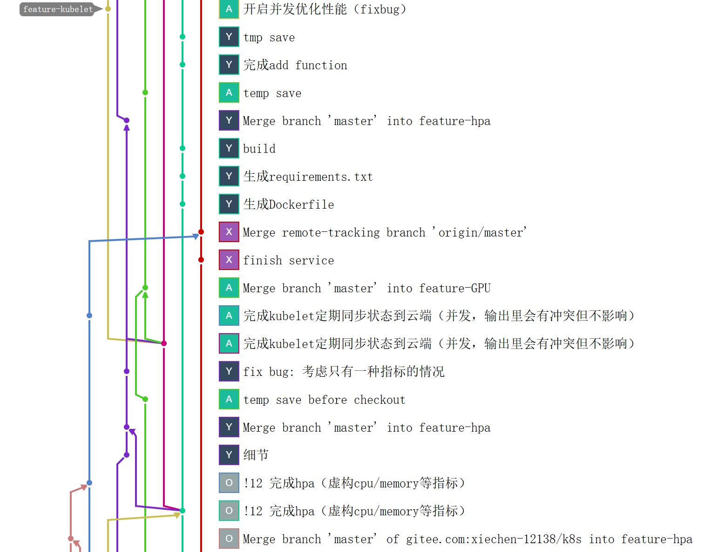

# minik8s - CloudOS

## 组员分工与贡献度

  |姓名         |分工                                   |贡献度|
  |------------|--------------------------------------|-----|
  |谢琛         |CNI、service、DNS                     | 1/3|
  |杨嘉路       |Replicaset、HPA、Serverless           | 1/3|
  |刘容川       |Kubelet、APIServer、Scheduler、GPU     |1/3|


## 项目总体架构


项目整体架构与Kubernetes的实现相当，做了一定简化。

APIServer负责为各个组件之间提供交互功能，系统各个对象的状态持久化在ETCD中，为控制面崩溃提供容错机制。

用户使用命令行工具Kubectl与系统进行交互，如创建删除更新对象和查看对象状态等。其他组件与APIServer通过HTTP协议和消息队列订阅两种方式通信。

**程序语言**：Go、Shell、Python

**软件栈**：ETCD、Docker、RabbitMQ、go-restful、CoreDNS、nginx、flannel、go-daily-lib/cli、go-yaml

## 项目结构与开发流程

1.  项目地址：[xiechen/k8s(gitee.com)](https://gitee.com/xiechen-12138/k8s)
    
2.  项目分支列表如下：

      

-   feature分支包含单一功能的代码，小组成员在各自负责的feature分支上进行开发

-   master分支为合并各个功能后的项目代码，可使用完整的功能，其他分支开发完成后，采用   pull-request方式合并至master分支并进行CI/CD的自动化测试。

-   fixbug分支用于在master分支上发现错误时签出解决bug
  
    pull-request情况与仓库网络图如下：

      

    

3.  CI/CD与测试

    我们使用gitlab的测试功能，基于程序运行环境构建了测试用的镜像，在构建镜像时使用运行脚本安装好了go、rabbitmq、etcd等依赖，并使用Makefile进行自动化的编译和运行。

    测试时我们使用go自带的test包对函数生成单元测试，并在gitlab-ci.yml中设置提交时自动触发运行测试程序

    


## 项目运行方法

**kubectl命令格式**
```shell
# node
kubectl create node -f <node yaml path>
kubectl get nodes

# pod
kubectl create pod -f <pod yaml path>
kubectl get pods                 #get simple info of all pods
kubectl get pod <pod name>       #get simple info of a pod
kubectl describe pod <pod name>  #get details of a pod
kubectl delete pod <pod name>

# service 
kubectl create service -f <service yaml path>
kubectl delete service <serviec name>
kubectl get services    # get service list
kubectl describe service <serivce name>    # get detail info of a service

# dns
kubectl create dns -f <dns yaml path>

# replicaset
kubectl create RS -f <rs yaml path>
kubectl update RS -f <rs yaml path>
kubectl delete RS <rs name>
kubectl describe replicaset <rs name> #get details of a rs
kubectl get replicasets               #get simple info of all rs

# hpa
kubectl create HPA -f <hpa yaml path>
kubectl update HPA -f <hpa yaml path>
kubectl delete HPA <hpa name>
kubectl describe hpa <hpa name>  #get details of a hpa
kubectl get hpas                 #get simple info of all hpas

# GPUJob
kubectl create GPUJob -f <GPUJob yaml path> -cu <cuda program path>
kubectl get GPUJob <job name>

# serverless
kubectl create function -f <*.py path> <function name>
kubectl update function -f <*.py path> <function name>
kubectl delete function <function name>
kubectl get functions

kubectl create workflow -f <workflow yaml path>
kubectl get workflows

kubectl invoke function <function name> <params>
kubectl invoke workflow <workflow name>
# 除了命令行，也可以使用http trigger的方式调用function和workflow
```

## 项目各组件功能与实现方式

> 我们在本部分中对解决的Corner Case、额外实现的功能或者我们认为较有挑战性的部分进行了**加粗**。

### APIServer

-   对ETCD中的数据进行增删改查：调用ETCD库的接口实现

-   处理HTTP请求：

    使用[go-restful库](https://github.com/emicklei/go-restful)，根据要求定义好WebServices和Routes对象以及相应的处理函数，即可处理特定请求。

-   监听ETCD数据变化并发布：

    在ETCD库的watch接口监听到数据变化后，根据数据类型发布至不同的[RabbitMQ](https://www.rabbitmq.com/)消息队列（publish-subscribe模式），订阅者开始订阅后每当消息队列中有新消息时便会自动调用用户指定的处理函数。

-   List-Watch 机制：

    list：调用资源的list API罗列资源，基于HTTP短链接实现；

    watch：调用资源的watch API监听资源变更事件，基于消息队列实现；

    client先通过list接口获取对象的全量信息，再使用watch机制获取对象的增量信息，期间间隔一段时间使用list矫正，便能实现比轮询更加节约资源的状态维护。

### Kubelet


-   kubelet的启动流程：

    1. 向APIServer发送HTTP请求获取PodList

    2. 根据调度结果在内存中维护本地运行的podList，并开启协程异步创建销毁容器

    3. 开始订阅pod的消息队列，根据消息内容删改podList，并异步修改本地容器

    4. 每5秒轮询本地镜像，同步状态至apiserver，并及时重启异常退出的pod

    5. 每60秒使用HTTP请求获取APIServer的PodList进行同步

-   **pod自动重启**：

    在设计上，pod对应的容器的基本信息储存在node本地，控制面不可见，当容器出现变化或更新时只需更新node保存在内存中的信息，而不需要对控制面存储的信息进行修改。  

    Kubelet会采用轮询的方法监听本机容器的状态，**当检测到本该正常运行在本节点的Pod对应的容器意外退出时将主动重启容器、当对应容器被删除时将自动重启pod**（删除容器并重新创建），这些操作仅修改node内存中pod与容器ID的映射信息，对控制面不可见，控制面仅能看到pod状态变为PENDING后一段时间又重新变为RUNNUING。由于不需要在控制面各个组件间反复传递信息，在容错的同时保证了性能。

### Scheduler

实现了RR调度策略，在内存维护Node列表，订阅pod的变化队列，将新建pod的node字段轮流赋值为node list中node的ip，然后存入ETCD。

各个node同样订阅pod列表监听其变化，当监听到有pod被调度到本节点时，立即创建对应pod。

### CNI

跨节点的pod间通信通过构建vxlan网络实现。在集群内每个节点新建一个vxlan，加入本节点docker0。当有新结点加入时，将新节点的实际IP设为vxlan的对端地址，并配置相应的路由、fdb、arp信息。节点退出时将相关信息删除。

将docker配置文件中的bip修改为设定好的子网段。

### Service

通过配置iptables实现。

将OUTPUT和PREROUTING链的的流量转发到KUBE-SERVICES链上。

对每个service，插入三层跳转规则：

> 第一层：从KUBE-SERVICES 到 KUBE-SVC-(service
> id)-(port)，每个端口对应一条目标链，分开service的各个端口
>
> 第二层：从KUBE-SVC-(service id)-(port) 到 KUBE-SVC-(service
> id)-(port)-(pod
> index)，每个pod对应一条目标链，通过设置概率进行负载均衡
>
> 第三层：进行DNAT，将数据包的目标地址从service的地址修改为pod的地址。

service的动态更新：当pod有变动时，会向相应消息队列推送消息，service监听到变动后根据消息的类型（新增/删除/更改）对iptables进行调整。在具体实现上，在service和pod之间增加endpoint对象，用于存储service对应的各pod的IP。


由于service之间是并发协程，同时大量执行iptables命令时可能因为竞争而执行失败，所以在插入/删除规则前后进行检查，确保规则被正确更改。

### DNS

在master节点上通过CoreDNS部署dns服务器进行域名解析。

各个子结点通过nginx进行路径解析。

当etcd中DNS对象变动时，向相应消息队列推送信息，各节点动态修改CoreDNS/nginx配置文件。

### Controller Manager


Controller Manager包括RS controller和HPA Controller。

#### **Replicaset**

-   Replicaset Controller监听API
    Server中RS的变化，并根据RS变化增加/更新/删除RS Worker。

-   每一个RS对象对应一个RS Worker。RS Worker监听API
    Server中对应pod的变化，如pod的数量不符合要求则触发sync操作。

-   **为减轻监听压力，每个replicaset根据selector监听不同的exchange
    name**，格式为`pods_<label_app>`，这样pod的增删消息只会被推送给相应的replicaset，其他replicaset无需响应。

#### **HPA**

HPA支持根据cpu和memory两种指标的平均利用率进行扩缩容。

计算方法：

$$期望副本数=ceil[当前副本数*(当前指标/期望指标)]$$

同时规定了cpu、memory两种指标时，取较大的期望副本数。

扩缩容策略：每15s增加/减少一个副本。

&emsp;

-   HPA Controller监听API
    Server中HPA的变化，并根据HPA变化增加/更新/删除HPA Worker。

-   每一个HPA对象对应一个HPA Worker。HPA
    Worker每隔15s检查一次对应pod的运行指标，计算出期望副本数，如与当前副本数不符，则将对应Replicaset的Replica字段+1/-1。

-   **为减轻轮询压力，设置pod运行指标的cache**，由cache统一向API
    Server轮询（10s一次），每个HPA Worker只需向cache轮询即可。

### GPU

构建了GPUServer镜像，该镜像搭载了编译好的go代码，将参数中指定的cuda文件以及根据配置文件中的设置生成的slurm脚本提交至云计算平台，并轮询获取返回结果存至ETCD。

参考kubernetes的Job的实现，kubectl的处理函数接收到GPUJob的创建命令后，创建pod（使用上述镜像生成容器），将Job和pod存入ETCD。

用户使用kubectl get命令即可获取job的运行状态与最终结果。


### Serverless 


Serverless平台具有以下功能：

function的增删改查、workflow的创建、function/workflow的调用。其中function/workflow的调用既可以通过http
trigger的方式向控制面的8090端口发请求，也可以通过kubectl命令行。

#### **Function**

函数格式（以add.py为例）：
```python
import flask, json
from flask import request
server = flask.Flask(__name__)
@server.route('/', methods=['post'])
def main():
    # 处理paramsJson
    params = json.loads(request.data)
    for param in params:
        if param['Name'] == 'x':
            x = param['Value']
        if param['Name'] == 'y':
            y = param['Value']
            
    # 函数逻辑
    x = x + y
    
    # 生成returnJson
    rets = [{'Name': 'x', 'Value': x}]
    return json.dumps(rets)
if __name__ == '__main__':
    server.run(debug=True, port=8888, host='0.0.0.0')
```

参数格式：
```json
[{"Name": "x", "Value": 2}, {"Name": "y", "Value": 3}]
```

返回值格式：
```json
[{"Name": "x", "Value": 5}]
```

-   function的创建：

    1. 将指定的python文件打包成docker镜像

    2. 将该镜像push到docker仓库中

    3. 存储该function的镜像地址，并持久化到etcd中

-   function的调用：
```shell
curl -X POST http://<serverless ip>:8090/<function name>  <params>
```
```shell
kubectl invoke function <function name> <params>
```

-   function的scale-to-0和自动扩容：

    -   使用Timer实现30s内无调用自动删除函数实例。

    -   复用hpa实现并发请求数增多时函数的自动扩容，扩容策略与hpa的扩容策略相同。

-   function调用流程：

    首先检查函数实例是否已存在

    已存在：

    1. 重置计时器至30s

    2. 直接向pod发送http请求，拿到结果

    不存在：

    1. 创建rs

    2. 创建service

    3. 创建hpa

    4. 等待所有pod就绪

    5. 添加30s计时器

    6. 向pod发送http请求，拿到结果

    计时器到时间时，删除对应函数实例（service+hpa+replicaset+pod）。

-   function的更新和删除

    > 更新/删除之前，首先检查有没有正在运行的函数实例，如有，则删除该函数实例（具体做法为将计时器重置为1毫秒）。

    更新：重新打包镜像并push到docker仓库，镜像名字不变，版本号+1。同时更新内存和etcd。

    删除：删除内存和etcd中存储的function信息。

#### **Workflow** 

workflow由yaml文件定义，格式如下：
```yaml
apiVersion: v1
kind: Workflow
metadata: 
  name: testworkflow2
start: add
params:
  - name: x
    value: 6
  - name: y
    value: 7
steps:
  - name: add
    type: function
    next: addFive
  - name: addFive
    type: function
    next: judge
  - name: judge
    type: branch
    choices:
      - variable: x
        type: equal
        value: 18
        next: printEqual
      - variable: x
        type: notEqual
        value : 18
        next: printNotEqual
  - name: printEqual
    type: function
    next: END
  - name: printNotEqual
    type: function
    next: END
```

start为起始函数，params为起始参数，steps为函数调用链的各个节点。

step有function和branch两种类型。function为实际的函数执行节点，并通过next将函数的返回值传递到下个节点。branch为分支节点，支持指定参数与常数的==,
!=, \>, \<, \>=, \<=六种比较，根据结果跳转下个节点。

当next为END时，函数调用链停止。  

&emsp;

调用workflow时，会依次调用链上的各个函数，如函数实例存在则直接发送请求，如不存在则等待函数实例创建好。

每个节点结束时，将returnJson赋给paramsJson，并进入下个节点。最终的returnJson即为workflow的返回值。
